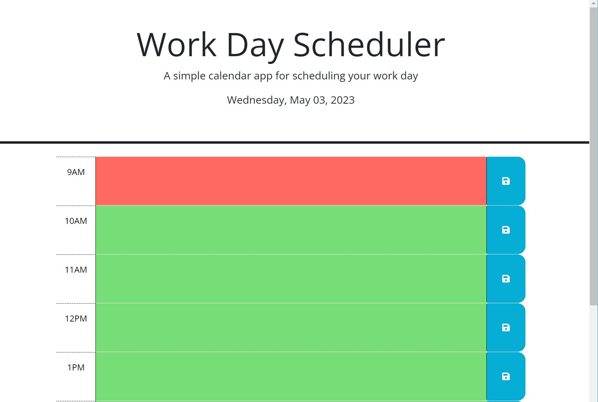

# Description
This is a day planner with one hour blocks to plan for your daily schedule

# User Story
```
I want to create a day planner with one hour block business hours (9AM - 5PM), and it has the ability to save my activities in each hour block
```

# Acceptance Criteria
```
WHEN I open the planner
THEN the current day is displayed at the top of the calendar
WHEN I scroll down
THEN I am presented with timeblocks for standard business hours
WHEN I view the timeblocks for that day
THEN each timeblock is color coded to indicate whether it is in the past (gray), present (red), or future (green)
WHEN I click into a timeblock
THEN I can enter an event
WHEN I click the save button for that timeblock
THEN the text for that event is saved in local storage
WHEN I refresh the page
THEN the saved events persist
```

# Mock up


[link](https://kzb11128.github.io/Challenge_05_Day_Planner/) to the planner